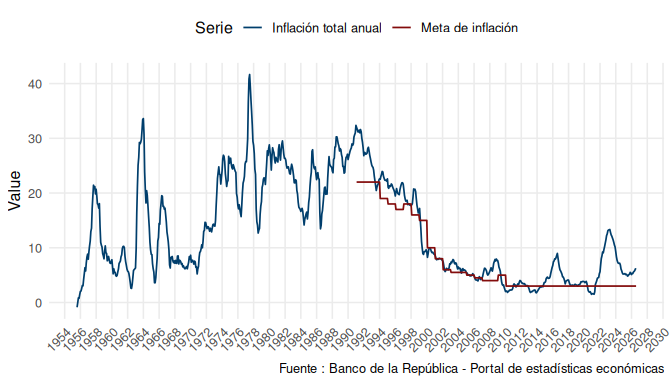

# banrepstats

<!-- badges: start -->
[](https://lifecycle.r-lib.org/articles/stages.html#experimental)
<!-- badges: end -->

`banrepstats` downloads economic time series from Banco de la
República’s (Colombia’s central bank) public statistics API — the same
data behind its
[SUAMECA](https://suameca.banrep.gov.co/estadisticas-economicas/#/)
portal — and returns them as tidy `data.table` objects, ready to explore
or plot.

## Installation

`banrepstats` is not on CRAN yet. Install it from GitHub with:

``` r
# install.packages("remotes")
remotes::install_github("fersalme/banrepstats", build_vignettes = TRUE)
```

``` r
library(banrepstats)
```

## Browsing the indicator catalog

Banco de la República organizes its indicators in a menu tree (topic -\>
sub-topic -\> indicator). `catalogo_banrep()` downloads that tree from
the live API and flattens it into a single table, one row per indicator:

``` r
catalogo <- catalogo_banrep()
nrow(catalogo)
#> [1] 61
head(catalogo)
#>    idGrupo         NombreGrupo idSerie
#>      <int>              <char>   <int>
#> 1:    1000 Precios e inflación  100001
#> 2:    1000 Precios e inflación  100002
#> 3:    1000 Precios e inflación  100003
#> 4:    1000 Precios e inflación  100004
#> 5:    1000 Precios e inflación  100005
#> 6:    1000 Precios e inflación  100006
#>                                    NombreSerie
#>                                         <char>
#> 1:                            Inflación y meta
#> 2:         IPC_Índice de Precios al Consumidor
#> 3:         IPP_Índice de Precios del Productor
#> 4: IPVU_Índice de precios de la vivienda usada
#> 5:                    UVR_Unidad de valor real
#> 6:                            Inflación básica
#>                          idNombreSerie
#>                                 <char>
#> 1:                    inflacion_y_meta
#> 2: indice_de_precios_al_consumidor_ipc
#> 3:  indice_de_precios_al_productor_ipp
#> 4:  indice_precios_vivienda_usada_ipvu
#> 5:               unidad_valor_real_uvr
#> 6:                    inflacion_basica
```

Each row is one indicator:

- `idGrupo` / `NombreGrupo`: the id and name of the parent topic (e.g.
  “Precios e inflación”).
- `idSerie` / `NombreSerie`: the id and human-readable name of the
  indicator itself (e.g. “Inflación y meta”).
- `idNombreSerie`: the indicator’s unique code. This is the value you
  pass to `banrep_data()`.

Not sure which code you need? `search_banrep()` looks up a keyword
(case-insensitive, partial match) against the topic and indicator names:

``` r
search_banrep("inflación")[, .(NombreGrupo, NombreSerie, idNombreSerie)]
#>            NombreGrupo                                   NombreSerie
#>                 <char>                                        <char>
#> 1: Precios e inflación                              Inflación y meta
#> 2: Precios e inflación           IPC_Índice de Precios al Consumidor
#> 3: Precios e inflación           IPP_Índice de Precios del Productor
#> 4: Precios e inflación   IPVU_Índice de precios de la vivienda usada
#> 5: Precios e inflación                      UVR_Unidad de valor real
#> 6: Precios e inflación                              Inflación básica
#> 7: Precios e inflación IPVNBR_Índice de precios de la vivienda nueva
#>                          idNombreSerie
#>                                 <char>
#> 1:                    inflacion_y_meta
#> 2: indice_de_precios_al_consumidor_ipc
#> 3:  indice_de_precios_al_productor_ipp
#> 4:  indice_precios_vivienda_usada_ipvu
#> 5:               unidad_valor_real_uvr
#> 6:                    inflacion_basica
#> 7:  indice_precios_vivienda_nueva_ipvn
```

## Downloading data

Pass one of those codes to `banrep_data()` to download the underlying
series as a single `data.table`:

``` r
precios <- banrep_data(indicator = "inflacion_y_meta")
head(precios)
#>                   id     unidad periodicidad       date value
#>               <char>     <char>       <char>     <Date> <num>
#> 1: Meta de inflación Porcentaje        Anual 1955-07-31    NA
#> 2: Meta de inflación Porcentaje        Anual 1955-08-31    NA
#> 3: Meta de inflación Porcentaje        Anual 1955-09-30    NA
#> 4: Meta de inflación Porcentaje        Anual 1955-10-31    NA
#> 5: Meta de inflación Porcentaje        Anual 1955-11-30    NA
#> 6: Meta de inflación Porcentaje        Anual 1955-12-31    NA
```

A single indicator can still bundle more than one related series —
notice how `"inflacion_y_meta"` alone already returns two:

``` r
unique(precios$id)
#> [1] "Meta de inflación"     "Inflación total anual"
```

You can request several indicators at once — the results come back
stacked in a single `data.table`:

``` r
datos <- banrep_data(c("inflacion_y_meta", "tasas_interes_politica_monetaria"))
unique(datos$id)
#> [1] "Meta de inflación"          "Inflación total anual"     
#> [3] "Tasa de política monetaria"
```

Fetching the catalog on every call has a network cost. If you don’t need
the live catalog, pass the bundled snapshot via `cache` to skip that
request:

``` r
precios_cache <- banrep_data("inflacion_y_meta", cache = banrep_cache)
identical(precios$value, precios_cache$value)
#> [1] TRUE
```

## Plotting a series

``` r
series_plot(precios)
#> Warning: Removed 426 rows containing missing values or values outside the scale range
#> (`geom_line()`).
```



`series_plot()` draws one line per distinct series (the `id` column),
colored with the package’s Banco de la República-inspired palette.

## What’s included

- `catalogo_banrep()` — download and flatten the live indicator catalog.
- `search_banrep()` — search the catalog by keyword.
- `banrep_data()` — download one or more indicators as a single
  `data.table`.
- `series_plot()` — plot a `data.table` returned by `banrep_data()`.
- `banrep_cache` — a bundled snapshot of the catalog, for offline
  lookups.

See `vignette("banrepstats")` for a longer walkthrough, including an
example of integrating with the `tsibble`/`fable` forecasting ecosystem.

## License

MIT
